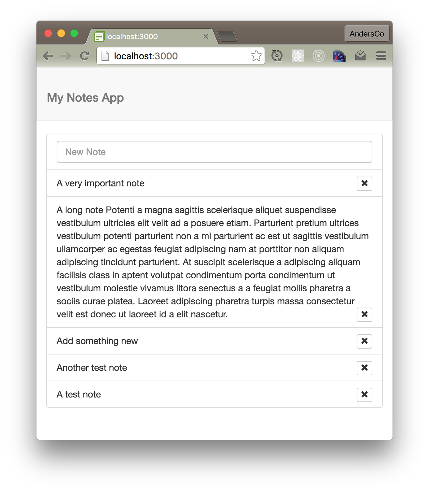

# Preview of Full-stack Web Development with Meteor and React
In this tutorial, we’re going to build a simple web app using using Meteor and React. This will be a simplified version of a more advance app we'll build in a two-day workshop on full-stack web development with Meteor and React.

## The app we'll build during the preview class

This app will basically be a Tracer Bullet of the app we'll build in the 2-day workshop.



- [Github Repo](https://github.com/CodeChron/intro-to-meteor-react): https://github.com/CodeChron/fullstack-js-preview

##Prerequisites 
- Basic knowledge of HTML, JavaScript, and use of a command line terminal.
- A laptop with a code editor of your choice.  We’ll be using [Sublime Text](http://www.sublimetext.com/3 ).
- Be sure to [install Meteor](https://www.meteor.com/install). We’ll be using Mac OSX. However, Meteor is available for Windows and Linux as well.

## Getting Started
Each step in the tutorial has a corresponding branch in the [github repo](https://github.com/CodeChron/intro-to-meteor-react).  I highly recommend that you create the app on your own, but if you should get stuck, you can always check out the branch from the previous step to get caught up.

### Getting caught up using git branches.
1. Clone the tutorial: ```git clone git@github.com:CodeChron/fullstack-js-preview.git```
2. Cd into the tutorial project: ```cd dir name```
2. Pull down all branches: ```git fetch --all```
3. View available branches: ```git branch -a```
4. Check out a specific branch: ```git checkout origin/[branchname]``` eg ```git checkout origin/setup```


## Additional Reading/Resources
- [Pete Hunt: Rethinking Best Practices](https://www.youtube.com/watch?v=DgVS-zXgMTk#t=1432)
_TODO_ Add links to my CodeChron blog posts


## Notes
- Discuss component hierarchy and visualization
- Discuss Trello board and feature backlog
