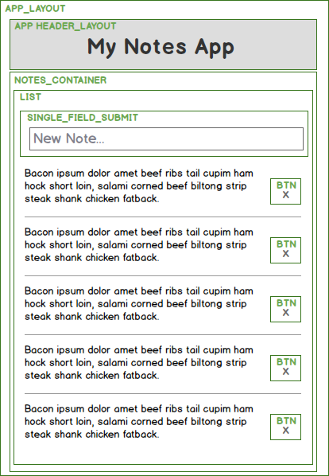

# Preview of Full-stack Web Development with Meteor and React 

## What we'll cover today

### The app we'll be building
_TODO: insert screen cap of finished app_

_TODO: demo the app_


### The app we'll build in the full course
_TODO: insert screen cap of finished app for full course_
_TODO: demo the app_

- Additional topics covered:
- Additional components, such as click to edit
- Login and Authentication
- Routing
- Security
- Handling list scaling
- Deployment


## Visualizing the app hierarchy



This is essential when building an app, to help with and planning and think through your component hierarchy.  


#Introduction to Meteor and React

<div style="text-align:center">
<a href="http://intro-to-meteor-react.meteor.com/"></a></div></div>

In this tutorial, we’re going to build a Todo app using Meteor and React.  We'll be taking a somewhat different approach from [the official Meteor React tutorial](https://www.meteor.com/tutorials/react/creating-an-app) and adding a few more bells and whistles along the way.

- [Finished version of the app](http://intro-to-meteor-react.meteor.com/)
- [Github Repo](https://github.com/CodeChron/intro-to-meteor-react)

##Prerequisites 
- Basic knowledge of HTML, JavaScript, and use of a command line terminal.
- A laptop with a code editor of your choice.  We’ll be using [Sublime Text](http://www.sublimetext.com/3 ).
- Be sure to [install Meteor](https://www.meteor.com/install). We’ll be using Mac OSX. However, Meteor is available for Windows and Linux as well.

## Getting Started
Each step in the tutorial has a corresponding branch in the [github repo](https://github.com/CodeChron/intro-to-meteor-react).  I highly recommend that you create the app on your own, but if you should get stuck, you can always check out the branch from the previous step to get caught up.

### Getting caught up using git branches.
1. Clone the tutorial: ```git clone https://github.com/CodeChron/intro-to-meteor-react.git```
2. Cd into the tutorial project: ```cd intro-to-meteor-react```
2. Pull down all branches: ```git pull --all```
3. View available branches: ```git branch -a```

Now, you should be all set to get caught up to a tutorial step if needed.

## Additional Reading/Resources
- [Pete Hunt: Rethinking Best Practices](https://www.youtube.com/watch?v=DgVS-zXgMTk#t=1432)
_TODO_ Add links to my CodeChron blog posts


# Overview

- Show the finished app we'll build in the weekend workshop.
- Discuss major features covered.
- As a preview, we're going to build a click-to-edit component.
- Create a dumb text block component.
- Enable the component to accept click events.
- Add a container component that handles the click event.
- Change the state of the container component to be edit state.
- Add a textarea component.
- Add some styling to make it full screen.
- Associate with data backend.
- Add auto-save
- Add a done button.
- For fun, add markdown, just to show how easy it is.


