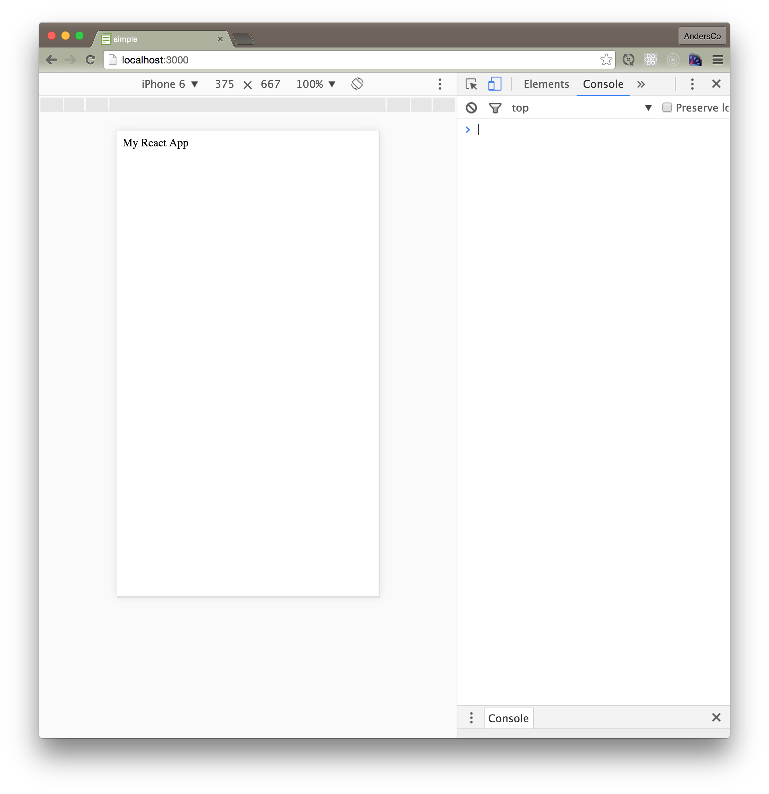

# Overview


## Add React
- Discuss using npm instead of Meteor packages

[NEW SECTION]

### Install React
- Discuss: what is react-dom?

``` npm i react react-dom --save  ```

- Discuss: save option

"By default, NPM simply installs a package under node_modules. When you're trying to install dependencies for your app/module, you would need to first install them, and then add them (along with the appropriate version number) to the dependencies section of your package.json.

The --save option instructs NPM to include the package inside of the dependencies section of your package.json automatically, thus saving you an additional step."
http://stackoverflow.com/questions/19578796/what-is-the-save-option-for-npm-install

## Add a top-level "app" React Component

``` /client/components/app.jsx ```

```js
import React from 'react'

export const App = () => <div>My React App</div>

```
Discuss: 
- modules
- stateless components


## Add a "render target" to your web app

We need to create a location for where to render our (future) React components.

``` /client/index.html ```


```html
<body><div id="app"></div></body>


## Tell Meteor to render to our target location on startup. 
Note the '.jsx' file name extension:

``` /client/startup.js ```

```js
import React from 'react'
import ReactDOM from 'react-dom'
import {App} from './app'

Meteor.startup(function(){
  ReactDOM.render(<App />, document.getElementById("app"))
})

You should now see something like this:


