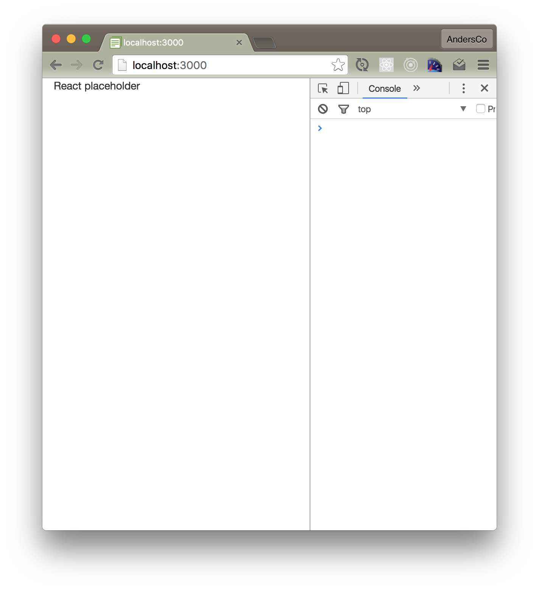

_Get caught up to this step: Check out branch 01-setup - see Introduction for info on how to get caught up using branches._
<hr>

# Step 2: Add React

## Install React Packages

```meteor npm install react react-dom --save```

- Why are we using npm instead of a Meteor package?
- What is the react-dom package?
- What is the purpose of the ```--save``` option? 

> "By default, NPM simply installs a package under node_modules. When you're trying to install dependencies for your app/module, you would need to first install them, and then add them (along with the appropriate version number) to the dependencies section of your package.json.

> The --save option instructs NPM to include the package inside of the dependencies section of your package.json automatically, thus saving you an additional step."

--["What is the --save option for?"](http://stackoverflow.com/questions/19578796/what-is-the-save-option-for-npm-install)

## Add an app layout component

``` /imports/compononents/layouts/app_layout.jsx ```
```js 
import React from 'react'

export const AppLayout = () =>
  <div id="app-container">
    <div id="main-content" className="container">
      React placeholder
    </div>
  </div>
```

- What is the '=>' thing?
- Isn't this just a plain JS function? Why are we not using React.createClass or React.Component?
- Why are we using 'className' rather than class?
 
## Replace Blaze with a React render target

``` /imports/startup/client/main.html ```

```html
<body>
  <div id="app"></div>
</body>
```

## Tell Meteor to render the app on startup
```js
import React from 'react'
import ReactDOM from 'react-dom'
import { AppLayout } from '/imports/components/layouts/app_layout'

Meteor.startup(() =>
	ReactDOM.render(<AppLayout />, document.getElementById("app"))
)
```

## Import (and render) on Startup

```js
import './main.html'
import './main.js'

```

You should now see this in your browser:


