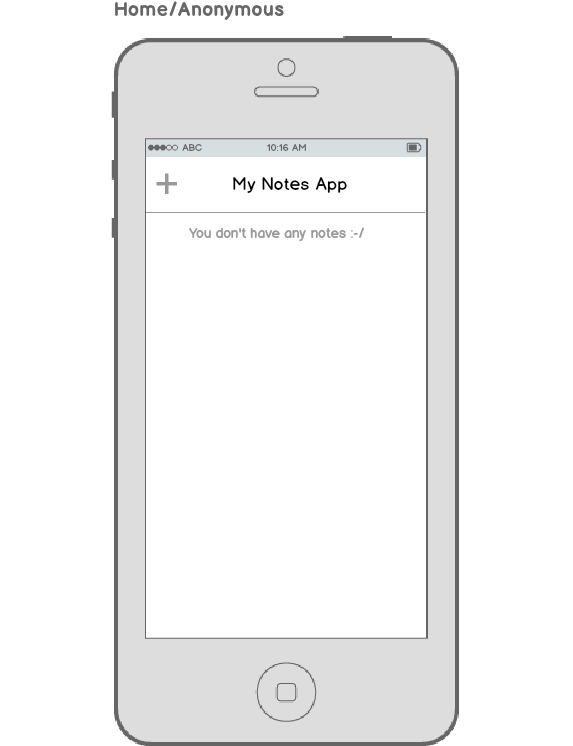
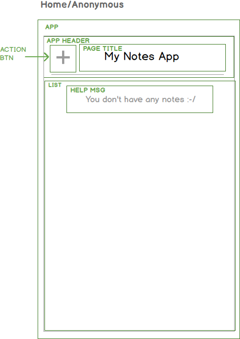

# Add an App Homepage
- Try going to /afsdfdsdfsf you'll see the same view is displayed.
- Create a new branch for this feature

# Review Homepage mockup

- move task to doing
- Add tasks in our feature card: add routing, add homepage, basic homepage components and layout.




Let's break this down into a component hierarchy: 




This will drive out our work for this feature.

(We'll create the first few components together and then you'll be creating the remaining on your own.)

- Add react via npm
- ```npm init -f```
- ```npm i react react-dom --save```
- look at package.json file
- discuss module system in Meteor 1.3: https://github.com/meteor/meteor/blob/release-1.3/packages/modules/README.md
- Add routing
-** Discuss Meteor packages**
- ``` meteor add kadira:flow-router ```
- ``` npm i react-mounter --save ```
- Discuss following the errors, eg "there is no route for '/'"

**Discuss Routes**
Add routes file:

``` /client/routes.jsx ```
- Discuss jsx file type

```js
// GLOBAL
import React from 'react'
import {mount} from 'react-mounter'

FlowRouter.route("/", {
	name: "homepage",
  action() {
    mount(MainLayout, {
        header: <AppHeader />,
        content: <NotesList />
    })
  }
})
```


- Discuss module system and imports vs Meteor's Magic Globals


- Discuss stateless functions:

 This is a stateless function or stateless component. It's a type of React component (though technically just a function) whose only job is to render output. It isn't aware of any state, it doesn't perform any logic. See https://facebook.github.io/react/docs/reusable-components.html#stateless-functions.  Technically the name MainLayout isn't needed here since it's an export default Plus, code clarity.


Follow the errors: "MainLayout is not defined"

Add /client/layouts/MainLayout.jsx, /client/pages/HomePage.jsx

```
import React from 'react'

export const MainLayout = ({content}) => <div className="app-container">{content}</div>
  ```
 Discuss use of ClassName and "HTML" in JSX
 

Import MainLayout

```js
// GLOBAL
import React from 'react'
import {mount} from 'react-mounter'

//LAYOUTS
import {MainLayout} from './layouts/MainLayout.jsx'

FlowRouter.route("/", {
	name: "homepage",
  action() {
    mount(MainLayout, {
        header: <AppHeader />,
        content: <NotesList />
    })
  }
})
```
With component placeholders added:
```js
// COMPONENTS
import {AppHeader} from './layouts/AppHeader.jsx'
import {NotesList} from './pages/NotesList.jsx'

FlowRouter.route("/", {
	name: "homepage",
  action() {
    mount(MainLayout, {
        header: () => <AppHeader />,
        content: () => <NotesList />
    })
  }
})
```
# Add PageTitle Component
``` /client/content/PageTitle.jsx ```

```js
import React, {PropTypes, Component} from 'react'

export default class PageTitle extends Component {
	render() {
    return <div>
      {this.props.pageTitle}
    </div>
	}
}

PageTitle.propTypes = {
	pageTitle: React.PropTypes.string.isRequired
};

```


# Add AppHeader Component

``` /client/layouts/AppHeader.jsx ```

```js
import React, {Component} from 'react'
import PageTitle from '../content/PageTitle.jsx'

export class AppHeader extends Component{
	render(){
		return (
			<header className="app-header">
        <div className="header-center">
          <PageTitle pageTitle="My Notes App" />
        </div>
      </header>
		)
	}
}
```


# Add Styling (split this into separate step)

Why text so small?

``` /client/head.html ```

```html
<head>
  <meta name="viewport" content="width=device-width, initial-scale=1.0">
</head>
```

## Should I use a framework like Bootstrap?
- Discuss pros and cons

## Install SASS
```meteor add fourseven:scss ```

Add AutoPrefixer:
```/scss.json ``` 

```json
{
  "enableAutoprefixer": true
}
```

TODO: Provide link to download stylesheets zip file. Discuss taking over someone else's css, a common thing when working as a dev

Commit and deploy


