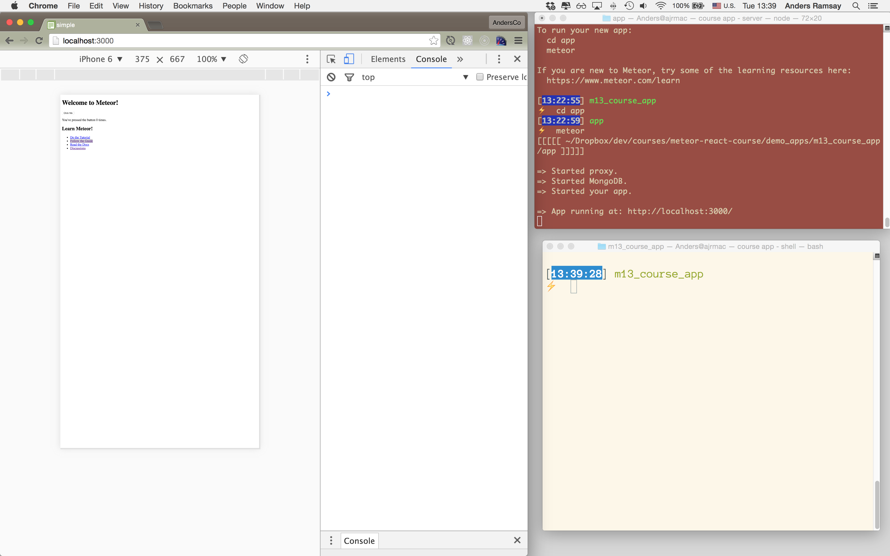

# App Setup

- create project dir with readme and tmp directory and .gitignore
- initialize git
- create Meteor app:
- Note new Meteor create: client and server dirs are created by default, package.json, and .gitignore also
- To run your Meteor app, just type ```meteor``` in your command line.
- Open a browser window and enter the URL: http://localhost:3000 
- You should see the default Meteor app.
- Leave this window open while building the app. Meteor will auto-refresh as you make changes.
- I also recommend having the console open in this window.  ([Viewing the console in Chrome](https://developer.chrome.com/devtools/docs/console).)
- run meteor and set up browser with console open, and terminals for server and shell:



## Replace some default Meteor files and code

``` rm client/main.css client/main.js ```

Update client/main.html to be as follows:

``` /client/main.html ```


```html
<head>
  <meta name="viewport" content="width=device-width, initial-scale=1.0">
</head>
<body><div id="app"></div></body>
```

- Discuss Metor Blaze rendering engine (which we removed)
- Discuss: why no html tags?


# Branch: 01-Setup
_keep these instructions brief and reference codechron blog posts_

## Project and App setup
Create your project directory

```mkdir my_notes_app  && cd my_notes_app```

```echo "# My Notes App" >> README.md```

(Optional, initialize a git repo.)

Reference: http://coderchronicles.org/2016/04/08/getting-started-with-meteor-1-3-react-and-flowrouter/#Create_a_project_directory_set_up_version_control_and_install_Meteor


## Create the Meteor app

```meteor create app``

``` cd app```

Start up your Meteor app and view both server and console.
See CodeChron article.

## Move app files into "imports"
- create imports dir
- move files into ```/imports/startup``` 
- import files to the client and server.

You should now see the same welcome info you see by default.  If so, you know your imports are set up properly.

## Add mobile meta tags

```html
<head>
  <meta name="viewport" content="width=device-width, initial-scale=1.0">
</head>
```
