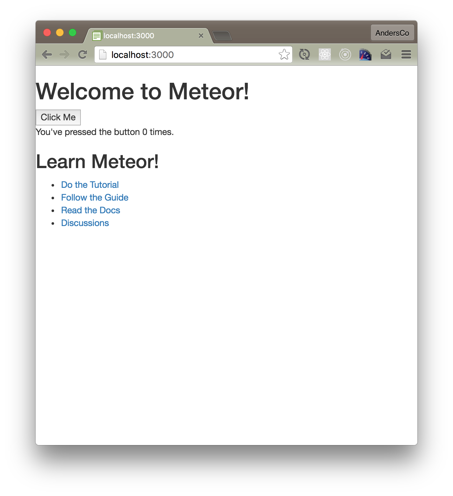

# Step 1: App Setup

_Branch name: 01-setup_ - see Introduction for info on how to get caught using branches.

## Project setup
Create your project directory and cd into it:

```mkdir my_notes_app  && cd my_notes_app```

Add a [ReadMe](https://en.wikipedia.org/wiki/README) file to your project: 
```echo "# My Notes App" >> README.md```

(Optional, [initialize a git repo](https://help.github.com/articles/adding-an-existing-project-to-github-using-the-command-line/).)


## Create the app
Create the Meteor app and cd into it:

```meteor create app``

``` cd app```

## Start the app and get set up for development

- Type ``` meteor ``` to run the app locally.
- Go to http://localhost:3000 to view your app.
- See [this blog post](http://coderchronicles.org/2016/04/08/getting-started-with-meteor-1-3-react-and-flowrouter/#Start_and_View_Meteor_in_Your_Browser) for a recommended local setup.


## Move app files into the "imports" directory
After the release of Meteor 1.3, it's generally considered good practice to place the majority of your files inside the imports directory and then load them as needed. [Learn more](http://guide.meteor.com/structure.html#javascript-structure) in the Meteor Guide.

- Create an imports directory, and a client-side directory for files we want to load on startup: ``` mkdir -p imports/startup/client ```
- Move files from ``` /client ``` to ```/imports/startup/client ```: ``` mv /client/main* /imports/startup/client` ``` 
- Add a "import manifest" file: 

``` /imports/startup/client/index.js ```

```js
import './main.css'
import './main.js'
```

- Import all files in the import manifest to the client:

``` /client/main.js ```

```js
import '/imports/startup/client'
```

You should now see the same welcome info you see by default.  If so, you know your imports are set up properly.

## Add mobile meta tags (optional)

```html
<head>
  <meta name="viewport" content="width=device-width, initial-scale=1.0">
</head>
```


## Install Bootstrap (optional)
This step is completely optional but it will make our app look a little nicer :-)

Make sure you are in your app directory:
``` meteor add twbs:bootstrap ```

After you install this, you should see the default welcome screen with Bootstrap styling applied.



