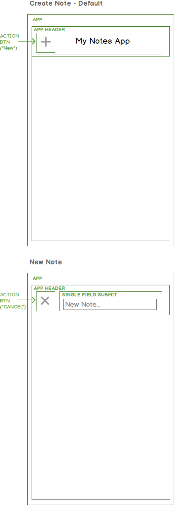

# Create a Note
Let's start with our mockups for this feature.
- update Trello board, add tasks for this note
- Reference mockups when listing tasks that are needed

- The "New Note" form should require an input.
- On submit of the form, a note should be created.  The value entered here becomes the Note title.
- On blur, creation of a new note should be cancelled.

## Pairing Activity
- Define what components you think would be needed, and draw a component hierarchy

## A Component Hierarchy

## Our tasks
- Add support for icons
- Create an ActionBtn icon that requires an icon prop, a title prop, and an action prop
- Create a SingleFieldSubmit that requires an input handler, requires a value on submit, and handles a blur event.
- Add a Notes collection for managing note data.
