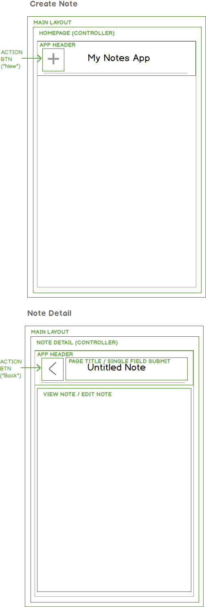

# Create Note - Simplified

Next, we are going to work on adding a note.
Let's review this functionality and the components that are needed.

This version of the UI that we'll use for creating a note will be kept as simple as possible, to allow for moving forward and implementing a complete user flow.  After that is completed, we can go back and make things more user-friendly.

This means that there might be some trade-offs initially.





Here, the user clicks on new note icon on the homepage.  This triggers the creation of a new note, followed by a redirect to the details view for that note.

## Add a "New Note" Button
The first step in our user flow is that of a user clicking on a "New" button to create a note.

# Add an ActionBtn Component

``` /client/forms/ActionBtn.jsx ```

```js
import React from 'react'

export default class ActionBtn extends React.Component {
	render() {
      return  <button 
        onClick={this.props.handleClick.bind(this)}
        className="icon-btn"
        title={this.props.title}
        alt={this.props.title}>
        <i className="material-icons">{this.props.icon}</i>
       </button>
	}
}

ActionBtn.propTypes = {
  icon: React.PropTypes.string.isRequired,
  title:  React.PropTypes.string,
  handleClick: React.PropTypes.func.isRequired
}
```

# Use Action Btn Component to in AppHeader/Homepage


- Discuss: Naming and organization of components
- Discuss: propTypes as API (what is an API)

# Adding Icons
Add this to ``` /client/head.html ```

```html
  <link href="https://fonts.googleapis.com/icon?family=Material+Icons"
      rel="stylesheet">
```


