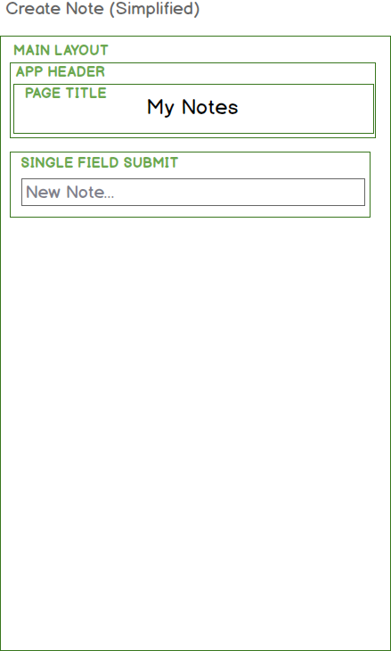

# Create a Note
- Reference the desired create note flow, with a redirect after create and a note details view. Also requires private notes which means authentications. It would also require adding routing. This is too advanced and too much to try to do all at once.
- Discus a the Tracer Bullet concept - do the bare minimum work needed to complete a flow.
- Discuss breaking larger problems into smaller ones.
- Let's therefore first implement a very basic Notes CRUD, then add the more advanced stuff.
- As before, we want to think visually when using React.  Here is our simplified app component hierarchy:

Here, we have a static app header and a component that submits that was input to a handler.

## Add an app header and a page title component
- Discuss: adding useful default values to components.
- Discuss: why not just include a page title in the app header?

## Add a single field submit component
- Discuss component naming
- After creating: where will the data go?

NOTE: May be introducing styling and SASS already here.
