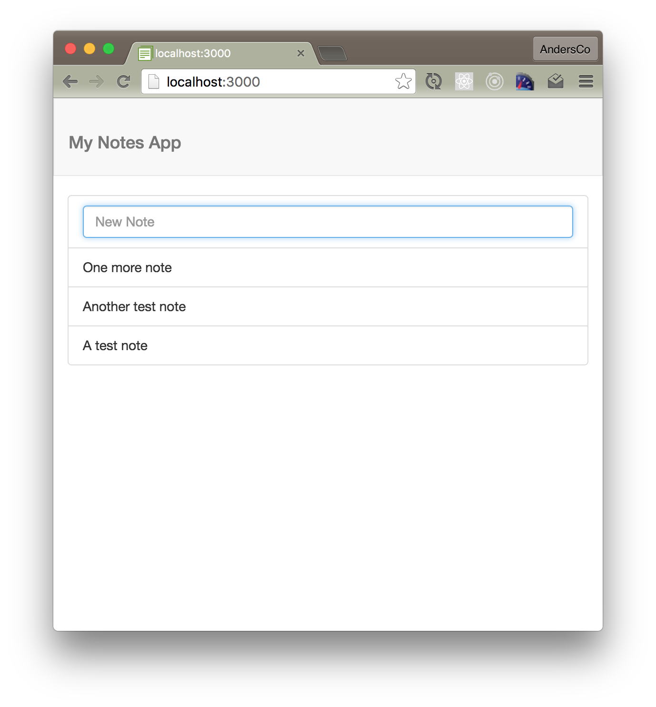

_Get caught up to this step: Check out branch 04-create-notes - see Introduction for info on how to get caught up using branches._
<hr>
# Step 5: List Notes

## Add a List Component
Let's add a list component, that displays new items as we add them, with our new item form on top.

``` /imports/components/lists/list.jsx ```

```js
import React from 'react'
import { SingleFieldSubmit } from '../forms/single_field_submit'

export const List = (props) =>{

	return <ul className="list-group">
    	    <li className="list-group-item"><SingleFieldSubmit {...props} />
    	   </li>
	    { 
	    	props.collection.map((item) => {
	 	      return <li key={item._id} className="list-group-item">{item.content}</li>
	      })
	    }
  </ul>
}

List.propTypes = {
	collection: React.PropTypes.array.isRequired
}
```

 - What is ``` {...props} ```?
 - What's going on with the use of ```.map``` and ```key```?
 - What's the purpose of ``` ...isRequired ```?

### Update NotesContainer

We now need to update our container to use the list rather than the form.

```js
...
import { List } from '../lists/list'


export default createContainer(() => {
   ...
	const notes = Notes.find({}, { sort: { updatedAt: -1 }}).fetch()	
  ...
  
  return {
  ...
    collection: notes
  }

}, List)

```

The browser should now update to display your notes as you add them.





