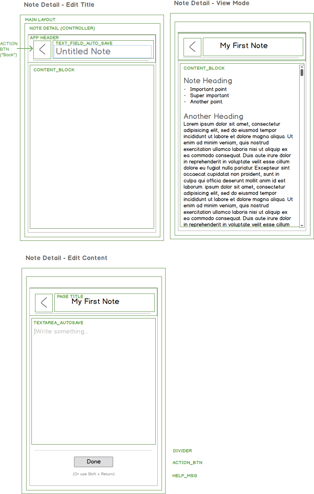

# Note Details View
- refactor AppHeader so it just accepts props (and works on both home and note details)
- on note details, do edit title first?  Edit Title would be an auto-save feature
- Discuss: display loading while waiting for subscription to be ready will be a common functionality, however, let's wait until we have two instances where it is needed before refactoring it out into its own function.
- Next: add edit title autosave

## Add Auto-saving Text Field
- requires a data handler
- changes are saved on keyup, with a throttle
- two types of input fields that are very similar but should they be the same component?

- Discuss: inserting comments into a JSX block
- React form inputs and managing state: http://blog.iansinnott.com/managing-state-and-controlled-form-fields-with-react/
- Discuss: binding functions http://egorsmirnov.me/2015/08/16/react-and-es6-part3.html
- 
- 
- 
